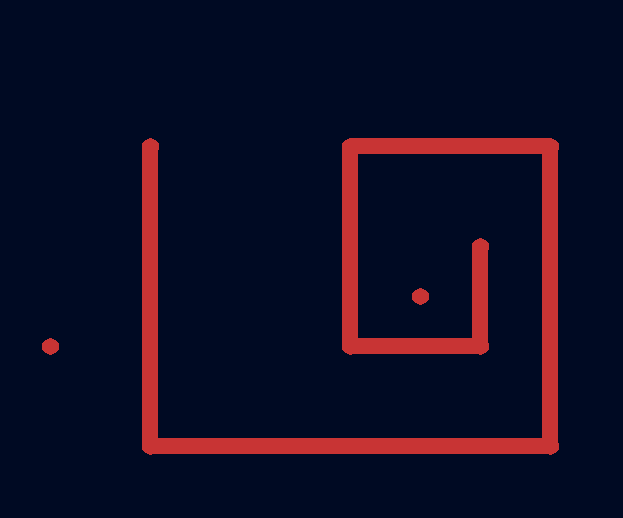
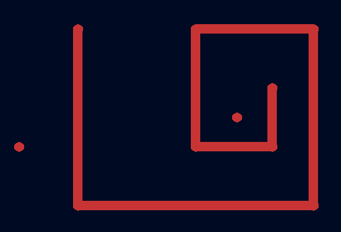
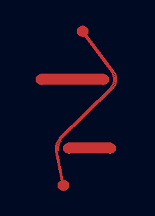

# Topola

Work-in-progress interactive topological router in Rust.

Join the [official Matrix chatroom](https://matrix.to/#/%23topola:tchncs.de) to talk with the
developers. 

## Contributing

[Official repository on Codeberg](https://codeberg.org/mikolaj/topola)

[Mirror repository on GitHub](https://github.com/mikwielgus/topola)

## Gallery

![Animation. There is an upward barrier in the middle and dots on the left and right of it, four each. A trace is drawn from the leftmost dot on the left to the rightmost dot on the right. Then a trace is drawn from the second leftmost dot on the left to the second rightmost dot on the right, displacing the previous trace so that there's space for the new one. Same happens for the remaining dots. The dots, traces and barrier are all solid red. The background is black but also very slightly white and blue.](./assets/shoving_around.gif "Shoving traces under other traces")

